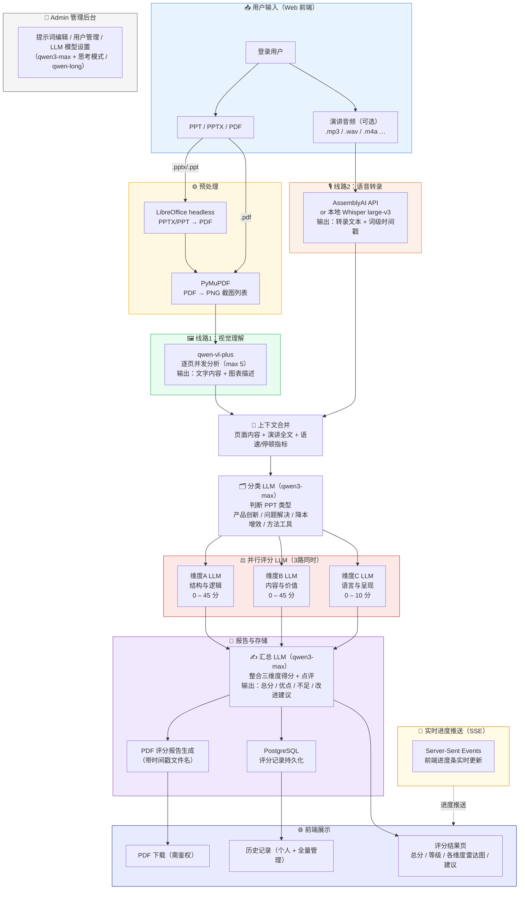

# BSH PPT 打分助手 · 项目说明文档

---

## 一、任务说明

**项目名称**：BSH PPT 智能打分助手（BSH AI Presentation Scorer）

**任务定义**：  
面向博西家电（BSH）内部工程师技术分享会场景，构建一套端到端的 AI 辅助评分系统。评委（工程师或管理层）将演讲者的 **PPT 文件 + 演讲录音** 上传至系统，由 AI 自动完成视觉解析、语音转录、多维度评分与 PDF 报告生成，输出量化得分与结构化文字反馈。

**定位**：赋能（Empower）而非考核（Audit）——协助演讲者发现自身短板，提供启发式改进建议，而不是简单地"打一个分数"。

---

## 二、业务场景背景

### 2.1 博西家电技术分享会

博西家电研发团队定期举办内部技术分享会（Tech Talk），鼓励工程师将项目实战经验、创新成果、方法论向跨部门同事进行分享。

分享会的价值在于：
- 促进跨品类、跨专业的工程经验复用（冰箱 ↔ 洗衣机 ↔ 烟灶）
- 培养工程师将专业成果转化为通用工程语言的能力
- 为管理层提供直观的人才能力评估依据

### 2.2 评分框架：5步法 + 3维度

分享内容遵循"**工程故事5步法**"：

| 步骤 | 名称 | 说明 |
|------|------|------|
| 1 | 起点（Trigger） | 为什么要做这件事？业务背景？ |
| 2 | 困境（Baseline） | 现有方案的局限？痛点在哪？ |
| 3 | 破局（Solution） | 核心技术动作是什么？ |
| 4 | 成效（Proof） | 用数据/事实证明成功 |
| 5 | 升华（Takeaway） | 跨领域可复用的工程方法论 |

AI 在此基础上从 **3个维度** 进行量化评分（满分100分）：

| 维度 | 名称 | 满分 | 核心考察点 |
|------|------|------|-----------|
| A | 结构与逻辑（Structure & Logic） | 45分 | 5步法覆盖度、逻辑连贯性、结论闭环 |
| B | 内容与价值（Content & Value） | 45分 | 数据硬度、业务相关性、跨界友好度、系统思维 |
| C | 语言与呈现（Language & Delivery） | 10分 | 时间把控、语速流畅度、口头禅频率 |

评分等级：**A（≥90）/ B（≥75）/ C（≥60）/ D（<60）**

### 2.3 PPT 类型识别

系统会先对 PPT 进行智能分类，评分维度中的侧重点会随类型动态调整：

| 类型标识 | 类型名称 |
|----------|---------|
| `innovation` | 产品创新型 |
| `problem_solving` | 问题解决型 |
| `cost_reduction` | 降本增效型 |
| `methodology` | 方法工具改进型 |

---

## 三、工作流示意图

---

## 四、待解决核心问题

### 4.1 评分一致性与可信度

- **问题**：不同批次调用 LLM，同一份 PPT 可能得到略有差异的分数，缺乏"评分锚点"。  
- **方向**：引入标准化评分样本库（Golden Set），定期校准 LLM 输出与人工评审的对齐程度；或使用思考模式（`enable_thinking`）提升推理稳定性。

### 4.2 音频-PPT 相关性判断精度

- **问题**：当演讲者的录音与 PPT 主题严重偏离时（低相关场景），现有的 30% 强制封顶逻辑是规则写死的，边界案例容易误判。  
- **方向**：优化相关性判断 prompt，增加典型低/中/高相关案例作为 few-shot 示例。

### 4.3 提示词可维护性

- **问题**：评分维度的细则（如各子维度权重、锚点分值）目前在 prompt 文件和代码中双向依赖，修改一处需同步维护另一处。  
- **方向**：将分值配置提取为独立的 `scoring_config.json`，prompt 动态注入，管理员可在前端统一修改。

---

## 五、最终目标

### 5.1 近期目标（当前阶段）

- [x] 完整的 Web 应用（注册/登录、文件上传、实时进度、结果展示、PDF 下载）
- [x] 管理员后台（提示词在线编辑、用户管理、LLM 模型切换 + 思考模式开关）
- [x] 历史记录持久化（个人记录 + 全量管理视图）
- [x] 生产部署（前端 build + 后端静态托管，一键 start.sh）

### 5.2 中期目标

- [ ] 引入标准评分样本库，建立 LLM 评分的人机对齐校准流程
- [ ] 支持批量评分（多份 PPT 一次性提交，队列异步处理）

### 5.3 长期目标

**将 BSH PPT 打分助手演化为博西家电内部的"工程分享能力成长平台"：**

1. **纵向追踪**：同一演讲者多次分享的得分趋势，量化能力成长曲线
2. **横向对标**：匿名化的跨部门/跨品类评分分布，帮助工程师定位自身在团队中的位置
3. **知识沉淀**：高分案例自动入库，形成可检索的工程故事最佳实践库
4. **AI 写作辅助**：在评分的同时，为低分维度直接生成"启发式填空"改进模板，一键生成修订建议段落

---

> 项目路径：`/home/wangjun/PPT_new`  
> 服务地址：`http://localhost:18766`
