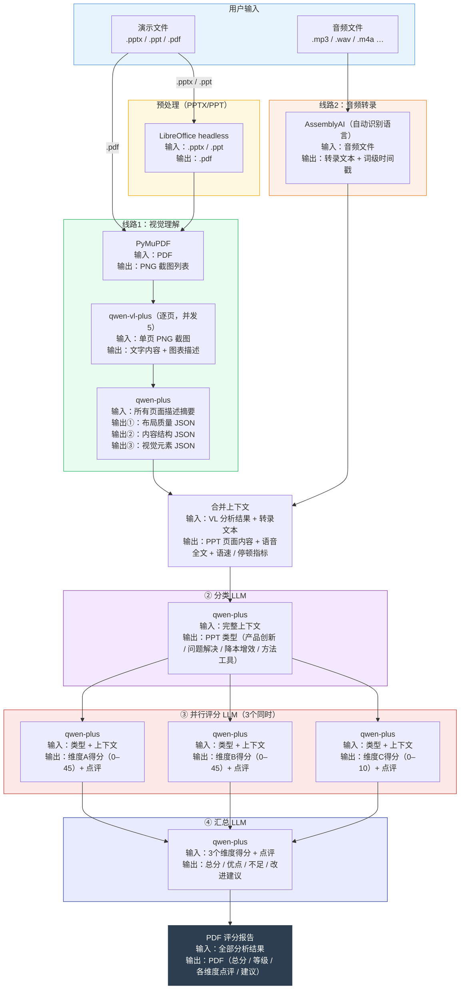

# AssemblyAI 音频转录及多模态数据处理全流程文档
## 一、AssemblyAI 音频转录计费方案（个人API 风险等级 高）
AssemblyAI 提供两款核心转录模型，计费按音频**实际播放时长**精准核算，未开启附加功能时仅收取基础模型费用，具体定价与触发规则如下：

| 模型名称       | 定位       | 计费单价   | 触发条件/支持语言                                                                 |
|----------------|------------|------------|----------------------------------------------------------------------------------|
| Universal-3 Pro| 新/高精度  | 0.21美元/小时 | 音频语言为**英语、西班牙语、德语、法语、意大利语、葡萄牙语**（共6种）|
| universal-2    | 默认/通用  | 0.15美元/小时 | 音频语言为上述6种之外的语言（如中文、日语、韩语、俄语等）|

### 关键计费细节
1.  **无附加费用**：未开启 Speaker Diarization（区分说话人）、Medical Mode（医疗模式），无需支付每小时0.02美元或0.15美元的叠加费用，仅需承担基础模型计费。
2.  **按秒计费，按时长核算**：计费单位为音频实际播放时长，与API接口处理耗时无关，精准按实际时长折算费用。
    - 示例：10分钟中文音频费用 = (10/60)小时 × 0.15美元/小时 = 0.025美元。

## 二、大模型 Token 计费标准（GDE API 风险等级 中）
本次处理涉及两款大模型，Token 消耗按**每百万 Tokens**统一计价，具体定价及折算参考如下：

| 模型名称   | 计费单价 |
|------------|----------|
| qwen-vl-plus | 0.8元/百万Tokens |
| qwen-turbo  | 0.3元/百万Tokens |

### Token 折算核心参考
1.  PDF截图：普通清晰度（1080p左右）含文字截图，单张折算1000~2000 Tokens；
2.  汉字文本：1个汉字 ≈ 1.2~1.5个 Tokens，1000个汉字文章约消耗1200~1500 Tokens；
3.  英文文本：1个英文单词 ≈ 1.3个 Tokens，1000个英文单词文章约消耗1300 Tokens。

## 三、整体数据处理流程
采用**双线路文本提取 + 智能分类 + 多LLM并行评分 + 最终LLM汇总**的全链路处理逻辑，流程清晰且可追溯，具体架构如下：

### （一）核心流程架构

### （二）流程步骤拆解
1.  **双线路文本提取**
    -  线路1（视觉理解）：.pptx/.ppt文件经LibreOffice headless转为PDF后，通过PyMuPDF生成PNG截图列表；调用qwen-vl-plus逐页分析（并发5），提取文字内容与图表描述；再由qwen-plus汇总为布局质量、内容结构、视觉元素三类JSON数据。
    -  线路2（音频转录）：音频文件通过AssemblyAI API自动识别语言，完成转录，输出完整文本与词级时间戳。
2.  **上下文合并**：将视觉分析结果与音频转录文本融合，生成包含PPT页面内容、语音全文、语速及停顿指标的完整上下文。
3.  **智能分类**：qwen-plus接收合并后的上下文，精准判定PPT类型（产品创新/问题解决/降本增效/方法工具）。
4.  **多维度并行评分**：3个qwen-plus模型同步运行，分别从3个维度（A/B/C）输出0-45分、0-10分不等的得分及针对性点评，提升评估全面性。
5.  **结果汇总输出**：最终汇总LLM整合3个维度得分与点评，生成总分、等级、优缺点及改进建议；最终输出完整PDF评分报告。

## 四、测试案例详情
### （一）测试文件信息
1.  演示文件：Test presentation 1.pdf（共6页）
2.  音频文件：audio_part1_16m40s-23m48s.mp3（时长427.5秒 / 7.13分钟）

### （二）评估结果
1.  PPT类型识别：方法工具改进型 (methodology)
2.  综合评分：总分91.0 / 100，等级评定为A

### （三）Token消耗明细
| 模块名称 | 模型名称 | 输入Tokens | 输出Tokens | 合计Tokens |
|----------|----------|------------|------------|------------|
| VL-逐页分析（第1页） | qwen-vl-plus | 1486 | 258 | 1744 |
| VL-逐页分析（第2页） | qwen-vl-plus | 1486 | 68 | 1554 |
| VL-逐页分析（第3页） | qwen-vl-plus | 1486 | 195 | 1681 |
| VL-逐页分析（第4页） | qwen-vl-plus | 1486 | 367 | 1853 |
| VL-逐页分析（第5页） | qwen-vl-plus | 1486 | 623 | 2109 |
| VL-逐页分析（第6页） | qwen-vl-plus | 1486 | 735 | 2221 |
| VL-汇总分析 | qwen-plus | 1363 | 152 | 1515 |
| 分类LLM | qwen-plus | 3530 | 140 | 3670 |
| 维度A评分LLM | qwen-plus | 1693 | 471 | 2164 |
| 维度B评分LLM | qwen-plus | 3967 | 953 | 4920 |
| 维度C评分LLM | qwen-plus | 4028 | 934 | 4962 |
| 汇总LLM | qwen-plus | 4397 | 1679 | 6076 |
| **总计** | - | - | - | **34469** |

### （四）费用核算明细（汇率1USD = 7.25CNY）
| 费用模块 | 具体说明 | 消耗/单价 | 费用金额 |
|----------|----------|------------|----------|
| VL逐页分析 | qwen-vl-plus（共6页，合计11162tokens） | 0.8元/百万Tokens | ¥0.0089 |
| VL后处理LLM | qwen-plus（1次合并，1515tokens） | 0.3元/百万Tokens | ¥0.0061 |
| 音频转录 | AssemblyAI（428秒，universal-3-pro） | 0.21美元/小时 | $0.0249 ≈ ¥0.1808 |
| 分类LLM | qwen-plus（3670tokens） | 0.3元/百万Tokens | ¥0.0147 |
| 3维度评分LLM | qwen-plus（12046tokens） | 0.3元/百万Tokens | ¥0.0482 |
| 汇总LLM | qwen-plus（7591tokens） | 0.3元/百万Tokens | ¥0.0304 |
| **总费用** | - | - | **¥0.2890** |

### （五）耗时统计
本次测试整体耗时：174.1秒

